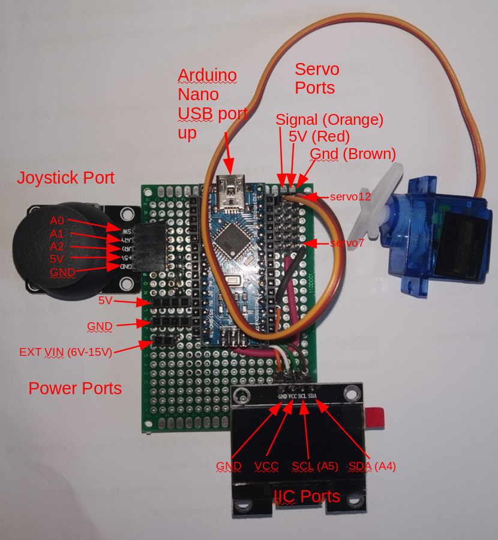

# Robotics Dev Board

A simple dev board/shield for robotics experiments with Arduino

## Board layout

## Arduino pinout

## Power

Can be powered in 3 ways:
1. USB (NOTE: use a thick cable if you are running lots of servos)
1. External 5V connected to 5V and GND
1. External battery 6V to 15V connected to VIN and GND
1. After making the diagram, I aadded two press sockets for thicker wires. The one on the leftmost edge of the board is GND and the one just inboard of it is the external battery positive connector.

## Display

Display is a SH1106 IIC display 128x64 pixels.

Use the U8g2 library for easy access, and the U8G2_SH1106_128X64_NONAME_F_HW_I2C class. All relevant examples should work.

A simple 4 port I2C bus is provided at the lower right hand corner, with the correct pinouts for a DiyMore display.

## Servo

There are pins for 6 servo connectors on the top right hand of the board.  The three rows on pins are:
1. GND (brown) on the far right
1. 5V (red) in the middle
1. Signal (orange) next to the Arduino

Be careful attaching servos - connecting the wrong way round will damage the servo and/or the Arduino.

The 6 sockets are arranged next to digital pins 7-12, and these are the signal pins for each servo.

As an example, to control a servo on pin 12:

`#include <Servo.h>
Servo servo12;
servo12.attach(12, 400, 2600);
servo12.write(angle);`

## Joystick

The Joystick is a simple analog joystick connected on analog pins A0, A1 and A2:
* A0 = SW (press down on joystick to trigger)
* A1 = Y (up/down movement of joystick)
* A2 = X (left/right movement of joystick)

NOTE: The SW pin does not have a pull up resistor.  Use:

`pinMode(A0, INPUT_PULLUP);`

to enable the Arduino pullup on the pin to get a reliable signal.
